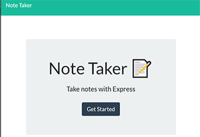

# Note Taker

[noteTaker walkthru video](https://drive.google.com/file/d/1nPlVIOv2-6reW6Xy9XvoDHafyBFrlbt6/view?usp=sharing)

#### App In Action

## Table of Contents

- [Description](#Description)

- [Installation](#Installation)

- [Instructions](#Instructions)

- [License](#License)

- [Contribute](#Contribute)

- [Tests](#Tests)

- [Questions](#Questions)

## Description

This is a fullstack app that uses html, css, bootstrap, nodeJS and express.It implements the following html routes GET '/' for the home page and GET '/notes/' for notes.html and GET '\*' for home page (index.html), It also implements the following api routes. GET '/api/notes' for getting saved notes in json format. GET '/api/notes/:id/ for getting a particular saved note. POST `/api/notes` to save a new note. DELETE `/api/notes/:id` to delete a particular note. The application does not use a db. Instead it uses a db.json file to save all the notes. Whenever a new note needs to be saved, a unique new id is created and the note title and note text are stored against the id in json format in the db.json file. On GETs information is read from the file and returned and rendered. On DELETEs, the note is deleted from the db.json file and page is re-rendered.

## Installation

You need express package installed for this app to run. So the steps are :

1. Clone this [repository](https://github.com/s-suresh-kumar/noteTaker)
2. Issue `npm i` at your local repository root, so that all dependencies (express package) is installed.
3. Then you can use loop back address on you to exercise this app. For that launch the app at the root of the repository 'nodemon server.js'. Then in the browser, go to http://localhost:3001/ and navigate from there to see the app in action.
4. You may also deploy it in deployment platforms such as Heroku and then access the app using the url provided by the platform.

## Instructions

Since this is a full stack app, the app needs to be deployed first.
There is a deployed version available in Heroku. The url for the deployed app is https://agile-everglades-01445.herokuapp.com/. From here by clicking on 'Get Started', you will be taken to the notes page. If there are any saved notes, they will be displayed. To see the details of a note, click on a saved note on the left. The note title and note text will be queried from backend and rendered on the right side of the page. To create a new note click on the 'pencil' icon and start typing the 'note title' and 'note text' in the placehoders for note title and note text respectively. Then click on the save icon at the top right corner of the page to save the note. See that it is saved in backend and the front end is re-rendered with the new saved note along with any old ones. To delete a note, click on the 'recycling bin' icon on the left against the note and an appropriate DELETE ajax call is made to the backend so that the note is deleted in backend and the fronend is re-rendered.

## License

This project is licensed under the [ISC](https://opensource.org/licenses/ISC) License.

## Contribute

Please use my e-mail to contact me on how to contribute to this project.

## Tests

There are no automated tests written for this app. However it is easy to launch the app and answer the questions, at the end team.html will be generated at the ./output directory.

## Questions

https://github.com/s-suresh-kumar

suresh01@yahoo.com
